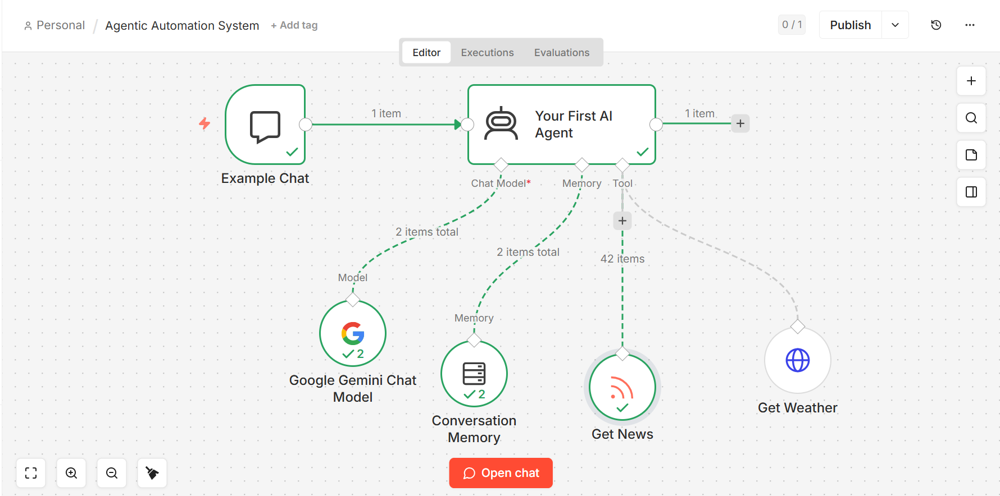
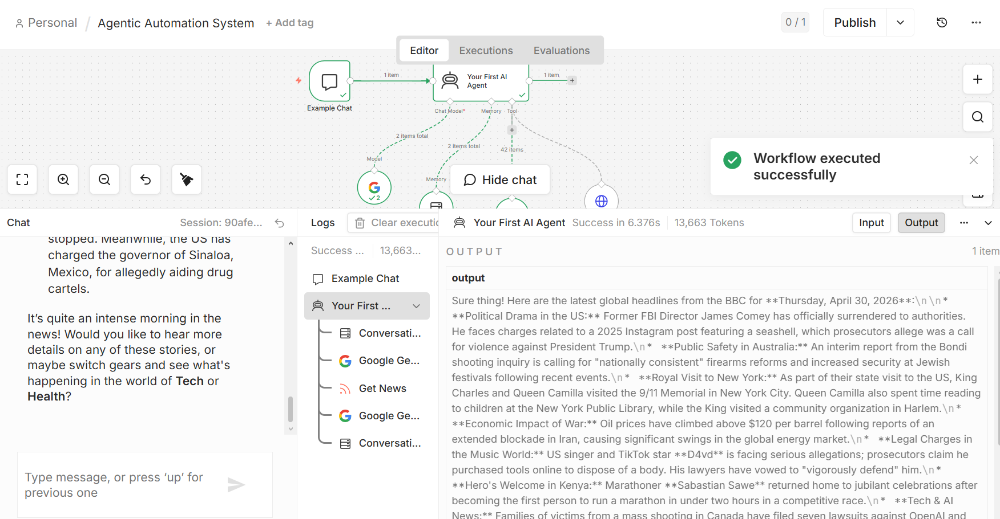

# 🤖 AI Agent Automation Platform (n8n + Gemini)

## 📌 Overview

This project implements an **Agentic AI Automation System** using **n8n** and **Google Gemini API**.

Unlike traditional chatbots, this system behaves like an **AI Agent** that can:

* Interpret user intent
* Decide the appropriate action
* Use external tools dynamically
* Maintain conversational memory

It demonstrates how **low-code automation + AI models** can be combined to build intelligent systems.

---

## 🧠 What is Agentic AI?

Agentic AI refers to systems that:

* Think before responding
* Choose tools dynamically
* Perform multi-step reasoning

In this project, the agent:

1. Receives user input
2. Analyzes intent using Gemini
3. Decides whether to call a tool
4. Executes API calls (weather/news)
5. Returns structured response

---

## 🏗️ System Architecture

The workflow is designed using **n8n visual automation**:

* **Trigger:** Chat input
* **LLM Node:** Google Gemini
* **Memory Node:** Stores conversation context
* **Tool Nodes:**

  * Weather API
  * News API
* **Response Output**

---

## 📸 Demo

### 🔧 Workflow Architecture



---

### 💬 AI Agent Output



---

## ⚙️ Workflow Logic (Detailed)

### 1. Input Handling

* User sends a query via chat interface
* Example:

  * “What’s the weather in Hyderabad?”
  * “Latest tech news”

---

### 2. AI Reasoning (Gemini)

* The Gemini model processes input
* Determines:

  * Is it general query?
  * Does it require tool usage?

---

### 3. Tool Selection

Based on intent:

* Weather → Weather API
* News → News API
* General → Direct response

---

### 4. Memory Usage

* Stores previous messages
* Enables contextual conversation
* Example:

  * “What about tomorrow?” → uses previous context

---

### 5. Response Generation

* Combines:

  * Model reasoning
  * Tool output
* Returns final answer to user

---

## 🚀 Features

* 🧠 AI-powered decision making
* 🔁 Stateful conversation memory
* 🌐 External API integration
* ⚡ Real-time automation
* 🔗 Modular workflow design

---

## 🛠️ Tech Stack

* **Automation:** n8n
* **AI Model:** Google Gemini API
* **APIs:** REST (Weather + News)
* **Format:** JSON-based workflow

---

## 📂 Project Structure

```
agentic-automation-n8n/
│
├── workflow.json       # n8n workflow file
├── project.png         # Workflow architecture screenshot
├── output.png          # Output demonstration
└── README.md           # Documentation
```

---

## ⚙️ Setup Instructions

### 1. Install n8n

```
npm install -g n8n
```

---

### 2. Start n8n

```
n8n
```

---

### 3. Open UI

```
http://localhost:5678
```

---

### 4. Import Workflow

* Click “Import”
* Upload `workflow.json`

---

### 5. Configure API Keys

* Add your Gemini API key
* Configure external APIs if needed

---

### 6. Execute Workflow

* Run the workflow
* Open chat interface
* Test queries

---

## 🔐 Security Considerations

* API keys are removed from this repository
* Use environment variables for credentials
* Do not expose sensitive data

---

## 💡 Use Cases

* AI assistants
* Automation bots
* Customer support systems
* Personal productivity tools

---

## 🚀 Future Improvements

* 🌐 Web UI (React frontend)
* 📱 Telegram / WhatsApp bot
* 🗄️ Database integration (MongoDB / Supabase)
* 🧠 Multi-agent architecture
* 🎙️ Voice input/output

---

## 📈 Learning Outcomes

Through this project:

* Learned agent-based system design
* Understood LLM + tools integration
* Built real-world automation workflows
* Explored low-code AI development

---

## ⚡ Key Highlights

* Built an **AI agent that uses tools dynamically**
* Implemented **conversation memory for context awareness**
* Integrated **LLM (Gemini) with real-world APIs**
* Designed using **n8n low-code automation workflows**

---

## 👩‍💻 Author

Lakshmi Varasri
# Agentic-Automation-System-n8n
AI Agent Automation Platform using n8n and Google Gemini API
